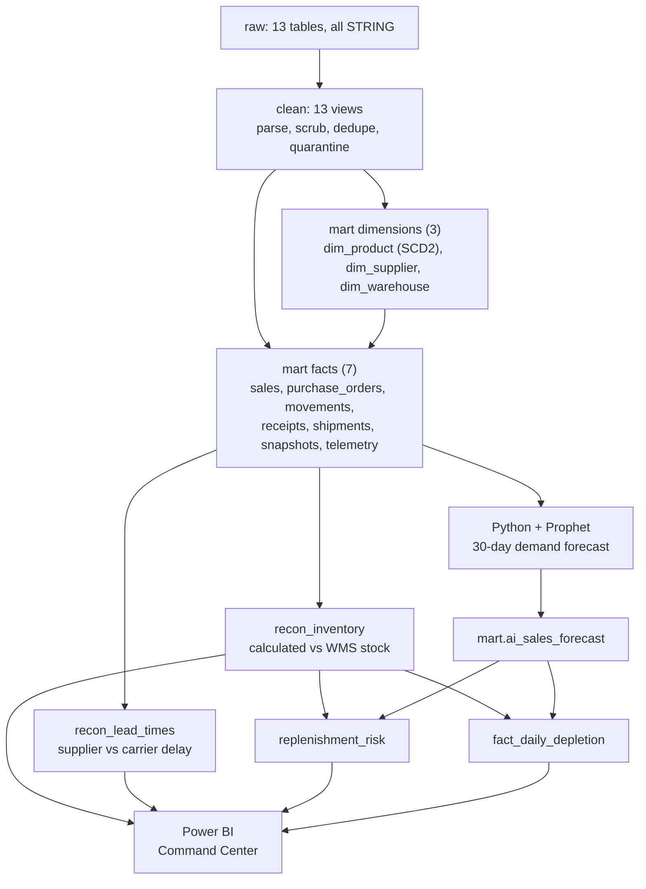
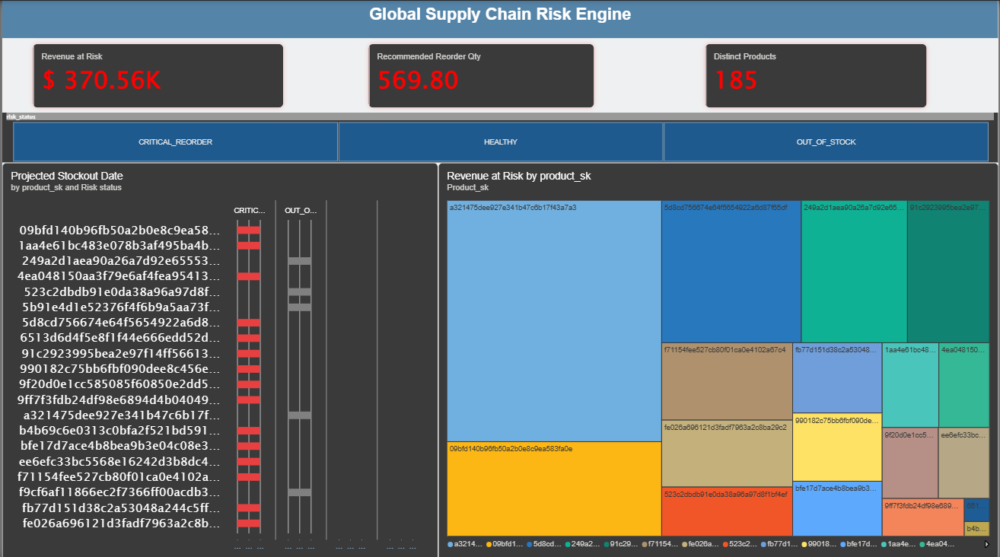
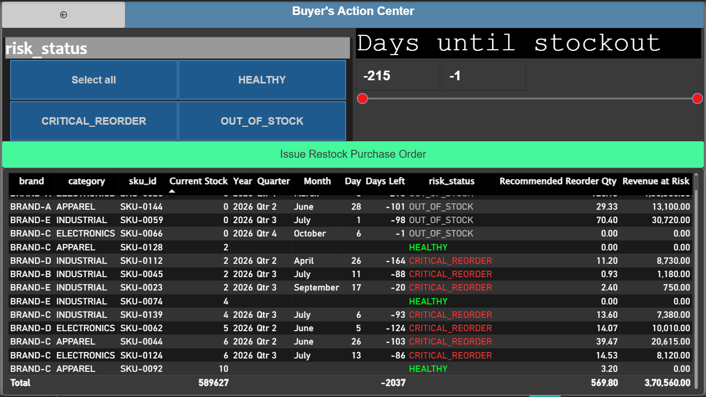
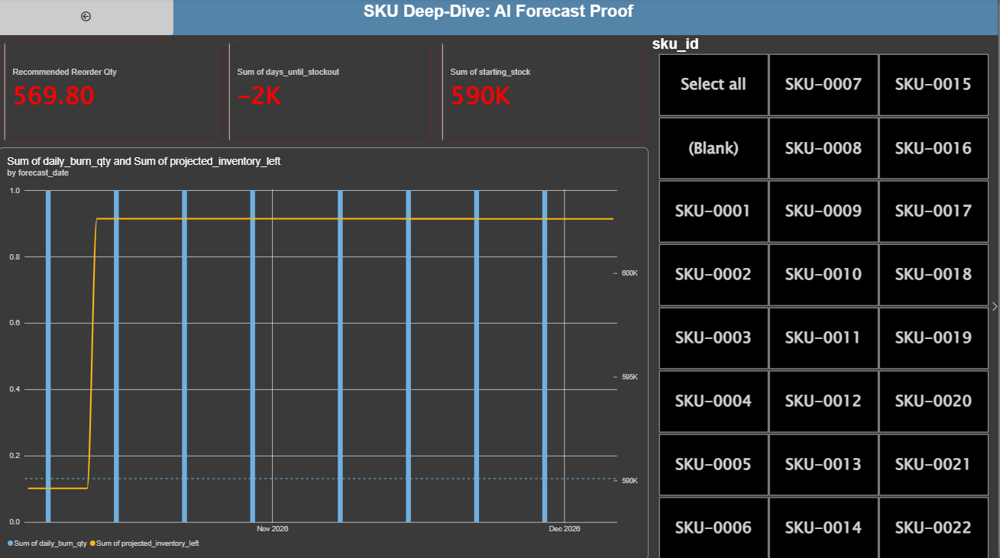

# 📦 Supply Chain Risk Command Center

**Turning chaotic ERP, warehouse, and carrier data into a trusted inventory-risk picture, built end to end with BigQuery SQL, Python (Prophet), and Power BI.**


> **Portfolio note:** All data in this project is **synthetic**. It was generated with `00_Raw_Data/faker.py` and deliberately corrupted to mimic real ERP, WMS, and carrier feeds (mixed date formats, `"N/A"` strings, currency-polluted numbers, duplicate updates, and physically impossible values). The goal is to demonstrate end-to-end analytics engineering: cleaning chaotic records, building a Kimball-style model, forecasting demand, and exposing financial and operational risk to business stakeholders.

---

## ⚡ At a Glance

| | |
|---|---|
| **Domain** | Supply chain: inventory, procurement, and logistics analytics |
| **Data** | 13 synthetic raw tables with intentionally messy, real-world defects |
| **Warehouse** | Google BigQuery with three layers: `raw` → `clean` → `mart` |
| **Staging** | 13 cleaning views with a quarantine system (`is_valid_record` + `exception_reason`) |
| **Data model** | Kimball star schema: 3 dimensions + 7 fact tables |
| **Analytics** | 2 reconciliation tables + 2 forecast-driven risk models |
| **ML** | Prophet 30-day demand forecast per product, written back to BigQuery |
| **BI** | Power BI executive "Command Center" dashboard |

---

## 🎯 What This Project Demonstrates

| Skill | Where to look |
|---|---|
| Defensive data cleaning (quarantine instead of delete) | `01_SQL/01_staging_layer/08_clean_sales.sql`, `09_clean_shipments.sql` |
| Parsing messy input: 10 date formats, currency strings, nested JSON | `05_clean_product.sql`, `13_clean_telemetry.sql` |
| Cross-table integrity checks (orphans, time-travel records) | `07_clean_receipts.sql` |
| SCD Type 2 repair (overlapping windows, false "current" flags) | `05_clean_product.sql`, `04_clean_policy.sql` |
| Dimensional modeling: hashed surrogate keys, point-in-time joins | `02_mart/03_dim_product.sql`, `04_fact_sales.sql` |
| Join-grain control and fan-out prevention | `11_recon_inventory.sql`, `12_recon_lead_times.sql` |
| Window functions, date scaffolding, running totals | `13_replenishment_risk.sql`, `14_fact_daily_depletion.sql` |
| Time-series forecasting and write-back to the warehouse | `02_Python/01_forecast_engine.ipynb` |
| BI and DAX | `03_Power_BI/` |

---

## 📌 The Business Problem: The "Flying Blind" Trap

Supply-chain decisions depend on reliable information about stock, demand, and incoming deliveries. When records are scattered across systems and formats, buyers decide with only part of the picture.

1. **Phantom inventory:** A warehouse system may report 50 units on the shelf while receipts, movements, and sales say there should be 40. Trusting the system without an independent audit leads to silent stockouts.
2. **The blame game:** When a delivery is late, suppliers blame carriers and carriers blame suppliers. Without separate handover and transit timestamps, SLA penalties can't be enforced.
3. **The stockout cliff:** Buyers who only look at today's stock reorder reactively, ignoring both future demand and deliveries already on the road.

**This pipeline exposes ghost inventory, assigns blame for delays with data, forecasts demand, and calculates the day each product is projected to run out of stock.**

---

## 💡 What I Built

1. **Staging layer (SQL):** 13 BigQuery views that standardize dates, strings, and numbers, remove duplicates, and quarantine invalid rows without deleting them.
2. **Star schema (SQL):** 3 dimensions and 7 facts. Product versions are tracked with deterministic hashed surrogate keys, and facts are matched to the product version that existed at the time of the event.
3. **Inventory reconciliation (SQL):** Physical stock is calculated from movements and compared to the WMS snapshot to isolate `FALSE_STOCK` and `MISSING_STOCK`.
4. **SLA accountability (SQL):** Supplier handover delay is separated from carrier transit delay, and missing physical goods are judged before timing.
5. **Demand forecasting (Python):** Prophet generates a 30-day forecast per product and writes it back to BigQuery.
6. **Risk and depletion models (SQL):** Cumulative forecast demand is subtracted from physical stock to find the projected stockout date and to simulate a day-by-day "fuel gauge".
7. **Executive dashboard (Power BI):** A three-page report: a risk overview (revenue at risk, recommended reorder quantity, stockout timeline), a buyer's action table with filters, and a per-SKU forecast and depletion deep-dive.

---

## 🏗️ Architecture



---

## 🗂️ Data Model

| Object | Type | Grain | Purpose |
|---|---|---|---|
| `dim_product` | Dimension (SCD2) | SKU version (`sku_id` + `effective_from`) | Product attributes over time, keyed by `product_sk` |
| `dim_supplier` | Dimension | Supplier | Supplier attributes |
| `dim_warehouse` | Dimension | Warehouse | Warehouse attributes |
| `fact_sales` | Fact | Order line | Orders, fulfilled quantity, price, status |
| `fact_purchase_orders` | Fact | PO line | Ordered quantity, cost, promised dates |
| `fact_movements` | Fact | Movement event | Inventory ledger entries by origin and destination warehouse |
| `fact_receipts` | Fact | Receipt line | Received vs rejected quantities at the dock |
| `fact_shipments` | Fact | Shipment × PO | Handover, ship, and expected-arrival dates |
| `fact_snapshots` | Fact | Warehouse × product × day | WMS-reported stock |
| `fact_telemetry` | Fact | Tracking ID × event | Carrier milestone and exception events |
| `recon_inventory` | Reconciliation | Warehouse × product | Calculated vs WMS stock |
| `recon_lead_times` | Reconciliation | PO × product | Shortage and supplier/carrier delay |
| `replenishment_risk` | Risk model | Product | First projected stockout date and risk status |
| `fact_daily_depletion` | Risk model | Product × day (30 days) | Day-by-day projected inventory |

---

## 🧹 Staging Layer: Defensive Data Cleaning

### Cross-cutting patterns

- **Quarantine, never delete.** Every clean view returns `is_valid_record` and an `exception_reason`. Bad rows stay visible for investigation, but marts only read `is_valid_record = TRUE`. The reason reflects the *first* failing rule in a cascading `CASE`.
- **Universal date parser.** A `COALESCE(SAFE.PARSE_TIMESTAMP(...))` cascade handles ISO timestamps (with and without timezone), `YYYY-MM-DD`, day-first formats, month-first formats, 10-digit Unix seconds, and Excel serial dates. Month-first formats are only accepted when the second field is greater than 12, which makes them unambiguous. Ambiguous dates default to day-first.
- **Ghost data.** `"N/A"`, blanks, padded strings, and mixed casing become true `NULL`s or normalized uppercase text, so joins don't silently fail.
- **Currency scrubber.** Regex strips symbols and letters, then a separator-aware rule handles both US (`1,499.00`) and European (`1.499,00`, `50,00`) formats before casting to `NUMERIC`.
- **Idempotent deduplication.** `ROW_NUMBER()` partitioned by each table's business key and ordered by latest `record_updated_at` keeps the final true state of each record.
- **Business-physics rules.** Examples: a cancelled order can't have fulfilled units, a shipment can't arrive before it ships, snapshots can't be negative, and movement quantity signs must match movement type.

### What each source needed

| Source | What was wrong | What the clean view does |
|---|---|---|
| `sales` | Prices and discounts polluted with symbols and mixed separators; a new row per status change; cancelled orders with fulfilled units | Money parser to `NUMERIC`; dedupe on `order_id + order_line`; quarantine `CANCELLED` with `fulfilled_qty > 0` |
| `purchase_orders` | Same money problem on unit cost; duplicate PO-line updates; 5 date columns | Money parser; dedupe on `po_id + po_line`; quarantine missing IDs, dates, or quantities |
| `receipts` | Receipts with no matching PO; receipt before PO creation; putaway before receipt; duplicate scans | Cross-check against `clean_purchase_orders` on `po_id + sku_id` → `ORPHAN_RECEIPT`, `TIMETRAVEL_RECEIPT`, `TIMETRAVEL_PUTAWAY_BEFORE_RECEIPT`; dedupe on `receipt_id + sku_id`; basic failures are never overwritten by advanced ones |
| `shipments` | Arrival before ship date; ship date before supplier handover; carrier webhook clones | Temporal validation; dedupe on `shipment_id + po_id` |
| `movements` | Mixed dates; `N/A` or blank warehouse and reference IDs; wrong-sign quantities | Sign rules by `movement_type` (outbound types must be ≤ 0, inbound types ≥ 0); `NULL` warehouses allowed by design (a sale has no destination warehouse) |
| `snapshots` | Duplicate updates for the same day; negative on-hand, reserved, or damaged quantities | Dedupe on `warehouse + sku + snapshot day`; quarantine negatives |
| `product_scd` | Overlapping validity windows; several rows flagged "current"; ghost SKUs; messy casing | `LEAD()` finds the next version; overlapping windows are snapped to end 1 second before the next starts; `is_current` is recalculated; `N/A` SKUs are quarantined |
| `policy_scd` | The same SCD problems at supplier × SKU × warehouse level | Same repair logic (staged for future reorder logic) |
| `telemetry` | Entire tracking history in one nested JSON string; epoch timestamps; duplicate webhooks | `JSON_QUERY_ARRAY` + `LEFT JOIN UNNEST` to one row per event; `TIMESTAMP_SECONDS`; dedupe on `tracking_id + event_name` |
| `fx_rates` | Padded or lowercase currency codes; text rates; mixed dates | Normalized codes, numeric rate, parsed date, quarantine flags |
| `fulfillments` | Mixed dates, text quantities, messy IDs | Typed and scrubbed with quarantine flags (staged, not yet consumed by the marts) |
| `suppliers`, `warehouses` | Casing and whitespace issues, `N/A` values | Scrubbing, typing, quarantine on missing IDs or names |

---

## ⭐ Mart Layer: Dimensional Modeling Decisions

- **Hashed surrogate key.** `product_sk = TO_HEX(MD5(CONCAT(sku_id, '|', effective_from)))` is deterministic, so it stays identical across rebuilds, which sequential IDs in a distributed warehouse can't guarantee. It also gives Power BI a single-column join key.
- **Point-in-time ("time-travel") joins.** Each fact is matched to the product version that existed when the event happened:

  ```sql
  LEFT JOIN mart.dim_product AS dp
    ON  s.sku_id = dp.sku_id
    AND s.order_timestamp >= dp.effective_from
    AND (s.order_timestamp < dp.effective_to OR dp.effective_to IS NULL)
  ```

  Applied to sales (`order_timestamp`), purchase orders (`po_date`), movements (`movement_timestamp`), receipts (`actual_receipt_date`), and snapshots (`snapshot_date`).
- **Grain-aware exceptions.** `fact_shipments` and `fact_telemetry` are deliberately *not* joined to `dim_product`, because carriers track the box, not the SKUs inside it.
- **Filtering in SQL, not in the BI tool.** `WHERE is_valid_record = TRUE` is applied in the mart, so no analyst can forget a dashboard filter and leak bad data into an executive report.
- **Nouns in dimensions, verbs in facts.** Engineering metadata (batch IDs, ingestion timestamps, exception reasons) is stripped from the mart.
- **The mart is a stable "showroom".** BI users only get access to `mart`. If the source system changes, the `clean` layer can be rebuilt without breaking dashboards.

---

## 📏 Analytical Models & Business Rules

### 1. Inventory reconciliation: `mart.recon_inventory`

```text
Calculated Physical Stock = Receipts + Movements In − Movements Out − Fulfilled Sales
Discrepancy               = WMS Reported Stock − Calculated Physical Stock
```

| Status | Meaning |
|---|---|
| `FALSE_STOCK` | WMS claims more than the ledger supports (ghost inventory) |
| `MISSING_STOCK` | WMS claims less than the ledger supports (shrinkage, theft, loss) |
| `ACCURATE` | WMS matches the ledger |

How it avoids common SQL traps:
- **No fan-out:** every source is pre-aggregated in a CTE to one row per warehouse × product *before* any join.
- **No missing items:** `FULL OUTER JOIN` keeps products that appear in only one source (for example, received but never sold).
- **No null math:** every component is wrapped in `COALESCE(..., 0)`.
- **Freshness lock:** the WMS claim uses only the latest snapshot date.

### 2. SLA accountability: `mart.recon_lead_times`

```text
Supplier Delay = Supplier Handover Date − Promised Ship Date
Carrier Delay  = Actual Receipt Date − Expected Arrival Date
```

Fulfillment status is a top-down waterfall (first match wins):

| Order | Status | Condition |
|---|---|---|
| 1 | `PENDING_SHIPMENT` | No ship date yet |
| 2 | `IN_TRANSIT` | Shipped, not yet received |
| 3 | `SHORT_SHIPPED` | Received quantity < ordered quantity |
| 4 | `SUPPLIER_LATE` | Handover after the promised ship date |
| 5 | `CARRIER_LATE` | Receipt after the expected arrival date |
| 6 | `ON_TIME` | None of the above |

Missing goods are judged before timing, so a short shipment is never mislabeled as merely "late". Shipments are pre-aggregated to one row per PO so a truck carrying 10 SKUs can't be counted as 10 trucks, and date math uses `SAFE_CAST(... AS DATE)` so a bad date produces `NULL` instead of crashing the pipeline.

### 3. Demand forecast: `02_Python/01_forecast_engine.ipynb`

- Pulls daily fulfilled units per `product_sk` from `mart.fact_sales`.
- Stretches each product's history to a **continuous daily calendar with zeros filled in**, all the way to one shared end date (the last sale date in the dataset). Prophet therefore sees zero-sales days instead of over-predicting demand, and every product's forecast starts on the same day.
- Fits one Prophet model per product (yearly and daily seasonality off, since the history is short) and forecasts 30 days with `include_history=False`.
- Post-processes the output: negative predictions are clipped to 0 and quantities are rounded to whole units.
- Writes the result to `mart.ai_sales_forecast` with `pandas_gbq`.

### 4. Replenishment risk: `mart.replenishment_risk`

```text
Projected Inventory = Starting Stock − Cumulative Forecast Sales
```

Starting stock is summed across all warehouses first (to stop multi-warehouse products from multiplying the forecast). A window function builds the running total of forecast sales, and `MIN(forecast_date)` where projected inventory ≤ 0 gives the first stockout date. The final `LEFT JOIN` from the inventory list guarantees healthy products stay in the report instead of being filtered out.

| Status | Rule |
|---|---|
| `OUT_OF_STOCK` | Starting stock ≤ 0 |
| `CRITICAL_REORDER` | Projected stockout within 14 days |
| `WARNING_LOW_STOCK` | Projected stockout in 15 to 30 days |
| `HEALTHY` | No projected stockout within the forecast horizon |

### 5. The "fuel gauge": `mart.fact_daily_depletion`

```text
Projected Inventory = Starting Stock − Cumulative Forecast Sales + Cumulative Inbound
```

- `GENERATE_DATE_ARRAY` + `CROSS JOIN` builds an unbroken 30-day calendar (starting the day after the dataset's as-of date) for every product, so charts never skip a day with zero sales.
- Two running totals (forecast sales and inbound deliveries) replace fragile "yesterday's balance" logic.
- Inbound deliveries are currently **simulated** (500 units arriving in 7 days for products with starting stock < 50) to demonstrate chart behavior. See the roadmap for connecting real open purchase orders.

---

## 📊 Power BI Dashboard

The report (`03_Power_BI/Supply_Chain_Risk_Command_Center.pbix`) reads from the `mart` dataset only and has three pages. Revenue and reorder metrics are calculated with DAX iterators (`SUMX`) over `replenishment_risk`.

### 1. Global Supply Chain Risk Engine
Landing page with KPI cards for **Revenue at Risk**, **Recommended Reorder Qty**, and **Distinct Products**, a risk-status slicer, a projected-stockout timeline per product, and a treemap showing where revenue at risk is concentrated.



### 2. Buyer's Action Center
Drill-through page for buyers: a filterable table (brand, category, SKU) with current stock, projected stockout date, days left, risk status, recommended reorder quantity, and revenue at risk, plus a risk-status slicer and a days-until-stockout range slider. The "Issue Restock Purchase Order" button is a design placeholder for a Power Automate flow.



### 3. SKU Deep-Dive: Forecast & Depletion
Select a SKU to compare the Prophet daily forecast (bars) with the projected inventory curve (line), which falls with forecast sales and steps up on the day a simulated inbound delivery arrives.



### DAX measures

```dax
Total 30-Day Forecast = SUM(ai_sales_forecast[predicted_sales_qty])

-- Model assumptions, defined once so they can be changed in one place
Lead Time Days    = 30
Safety Stock Days = 14
Avg Unit Price    = COALESCE(AVERAGE(fact_sales[unit_price_foreign]), 150)

Recommended Reorder Qty =
SUMX(
    replenishment_risk,
    VAR AvgDailySales = DIVIDE([Total 30-Day Forecast], 30)
    VAR TargetStock   = AvgDailySales * ([Lead Time Days] + [Safety Stock Days])
    VAR OnHand        = MAX(replenishment_risk[starting_stock], 0)
    RETURN ROUNDUP(MAX(TargetStock - OnHand, 0), 0)
)

Revenue at Risk =
SUMX(
    replenishment_risk,
    VAR AvgDailySales  = DIVIDE([Total 30-Day Forecast], 30)
    VAR DaysToStockout = replenishment_risk[days_until_stockout]
    VAR UncoveredDays  = MAX([Lead Time Days] - MAX(DaysToStockout, 0), 0)
    RETURN
        IF(
            replenishment_risk[risk_status] = "HEALTHY" || ISBLANK(DaysToStockout),
            0,
            UncoveredDays * AvgDailySales * [Avg Unit Price]
        )
)
```

- **Recommended Reorder Qty** is an order-up-to calculation: forecast daily demand × (lead time + safety days), minus on-hand stock (floored at zero), rounded up to whole units.
- **Revenue at Risk** is the demand expected during the part of the replenishment lead time that stock does *not* cover, valued at the product's average selling price. Healthy products contribute zero.
- The measures rely on relationships from `replenishment_risk[product_sk]` to `ai_sales_forecast` and `fact_sales`, so each row's measure calls (context transition) filter to that product only.

---

<!--
## 📈 Results Snapshot (uncomment after filling in your real numbers)

| Metric | Value |
|---|---|
| Raw rows quarantined (all tables) | X% |
| Most common quarantine reason | EXAMPLE_REASON (X rows) |
| SKU-warehouse pairs flagged `FALSE_STOCK` | X |
| Total unit discrepancy (WMS vs calculated) | X units |
| Products in `CRITICAL_REORDER` | X |
| POs classified `SUPPLIER_LATE` vs `CARRIER_LATE` | X vs X |
-->

## ✅ Validation Queries

Sanity checks to run after a full build:

```sql
-- 1. Fan-out check: fact rows must equal valid clean rows (a higher number means the temporal join duplicated rows)
SELECT
  (SELECT COUNT(*) FROM clean.clean_sales WHERE is_valid_record) AS valid_clean_rows,
  (SELECT COUNT(*) FROM mart.fact_sales)                         AS fact_rows;

-- 2. Unmatched product versions (facts that didn't resolve to a product_sk)
SELECT COUNT(*) AS facts_without_product_sk
FROM mart.fact_sales
WHERE product_sk IS NULL;

-- 3. SCD overlap check on dim_product: should return 0 rows
SELECT sku_id, effective_from, effective_to, next_from
FROM (
  SELECT sku_id, effective_from, effective_to,
         LEAD(effective_from) OVER (PARTITION BY sku_id ORDER BY effective_from) AS next_from
  FROM mart.dim_product
)
WHERE next_from IS NOT NULL
  AND (effective_to IS NULL OR effective_to >= next_from);

-- 4. Why rows were quarantined
SELECT exception_reason, COUNT(*) AS rows_quarantined
FROM clean.clean_sales
WHERE NOT is_valid_record
GROUP BY exception_reason
ORDER BY rows_quarantined DESC;
```

---

## ⚠️ Assumptions & Known Limitations

- **Synthetic, static data.** Ingestion is CSV-based. A production version would need an orchestrator (Airflow or dbt) and incremental loads.
- **Date assumptions.** Ambiguous dates are read as day-first, and timestamps without a timezone are treated as UTC.
- **Currency.** Monetary columns stay in their original currency (`*_foreign` plus `currency_code`). `clean_fx_rates` is staged but not yet joined in the mart layer, and it currently rounds rates to 2 decimals, which would need more precision before real conversion.
- **Staged but unused tables.** `clean_fx_rates`, `clean_policy`, and `clean_fulfillments` are cleaned and ready but not yet consumed by marts.
- **Product-version grain.** Reconciliation and forecasting are keyed on `product_sk` (a product *version*). For SKUs whose attributes changed over time, a production design would add a durable `sku_id` to facts and reconcile at SKU level.
- **Forecast scope.** Demand is approximated with *fulfilled* units, which understates true demand during stockouts. There is no train/holdout split or MAPE validation, and products are forecast sequentially in a loop.
- **Time anchoring.** Because the dataset is static, "today" is the dataset's **as-of date** (the last observed sale day), not `CURRENT_DATE()`. The forecast, stockout dates, and depletion calendar all share that timeline and the same 30-day horizon.
- **Simulated inbound.** `fact_daily_depletion` uses a hardcoded inbound scenario rather than real open purchase orders.
- **Telemetry dedupe.** One row is kept per `tracking_id + event_name`, so repeated events of the same type collapse into the latest.
- **Dashboard assumptions.** Lead time (30 days) and safety stock (14 days) are fixed DAX measures rather than values read from `clean_policy`. Average selling price is taken in source currency until FX conversion is added. The "Issue Restock Purchase Order" button is a design placeholder, not connected to a live ERP.

---

## 🛣️ Roadmap

- Replace the simulated inbound CTE with real open POs (`fact_purchase_orders` minus `fact_receipts`).
- Apply FX conversion using `clean_fx_rates` so financial metrics are comparable across currencies.
- Use `clean_policy` (reorder point, safety stock, lead time) for dynamic reorder logic instead of the fixed 30-day lead time and 14-day safety stock in the DAX measures.
- Add dashboard pages for phantom inventory (`recon_inventory`) and supplier-vs-carrier accountability (`recon_lead_times`), which are already modeled in the mart.
- Add forecast validation (holdout split, MAPE/WAPE) and parallelize per-product training.
- Orchestrate with Airflow or dbt for lineage, scheduling, and automated tests.

---

## 🧰 Technology Stack

| Technology | What I used it for |
|---|---|
| **Google BigQuery** | Data warehouse for the `raw` / `clean` / `mart` layers, staging views, dimensional model, risk models |
| **SQL (BigQuery dialect)** | CTE pipelines, `SAFE.PARSE_TIMESTAMP` cascades, regex cleaning, JSON unnesting, window functions, temporal joins, date scaffolding |
| **Python & Pandas** | BigQuery extraction, continuous time-series construction, forecast post-processing |
| **Meta Prophet** | Per-product 30-day demand forecasting |
| **pandas-gbq** | Reading from and writing back to BigQuery |
| **Power BI** | DAX measures (`SUMX`), risk matrix, SKU drill-through, executive dashboard |

---

## 📂 Repository Structure

```text
.
├── 00_Raw_Data/
│   ├── faker.py                  # Synthetic data generator
│   └── raw_*.csv                 # Deliberately messy raw extracts
├── 01_SQL/
│   ├── 01_staging_layer/         # 13 cleaning views (01 → 13)
│   └── 02_mart/                  # 3 dimensions, 7 facts, 2 recon tables, 2 risk models (01 → 14)
├── 02_Python/
│   ├── 01_forecast_engine.ipynb  # Prophet forecast + BigQuery upload
│   └── requirements.txt
└── 03_Power_BI/
    ├── Supply_Chain_Risk_Command_Center.pbix
    └── screenshots/
```

---

## 🚀 How to Reproduce

**Prerequisites:** a Google Cloud project with BigQuery enabled, Python 3.11+, and Power BI Desktop.

1. **Create datasets.** Create `raw`, `clean`, and `mart` in the same BigQuery location, and run all queries with your project selected as the default.
2. **Load raw data.** Upload each CSV from `00_Raw_Data/` into a matching table in `raw`: `fulfillments`, `fx_rates`, `movements`, `policy_scd`, `product_scd`, `purchase_orders`, `receipts`, `sales`, `shipments`, `snapshots`, `suppliers`, `warehouses`, `telemetry`. **Load every column as `STRING`** (disable schema auto-detect). The cleaning layer is responsible for typing.
3. **Run the staging layer.** Execute `01_SQL/01_staging_layer/` in numeric order. `06_clean_purchase_orders` must run before `07_clean_receipts`, which depends on it.
4. **Build the mart.** Run `01_SQL/02_mart/` files **01 → 12** in order: dimensions, then facts, then the two reconciliation tables.
5. **Generate the forecast.** `pip install -r 02_Python/requirements.txt`, authenticate to Google Cloud (for example `gcloud auth application-default login`), set `project_id` in `01_forecast_engine.ipynb`, and run all cells. This creates `mart.ai_sales_forecast`.
6. **Build the risk models.** Run `13_replenishment_risk.sql`, then `14_fact_daily_depletion.sql`.
7. **Open the dashboard.** Open the `.pbix`, point the BigQuery source to your project, and refresh.

---

## 👤 Author

**Aftab Khan**, Data Analyst
Specializing in SQL data architecture, ETL pipelines, and business intelligence dashboards.

[LinkedIn](https://www.linkedin.com/in/blackbean0099) · [Portfolio](https://blackbean0099.vercel.app) · [Email](mailto:blackbean0099@gmail.com)